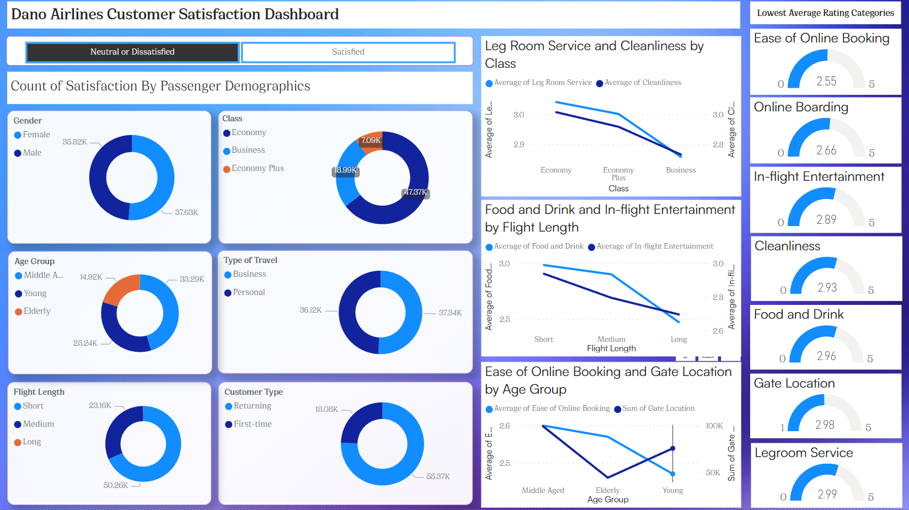

# Danoairlines

## A Digitaley drive Project
This Data Analysis project aims to provide insights for Dano Airlines, a (fictional) Uk-based airline headquartered in London, United Kingdom whose latest passenger survey results show a dip in satisfaction rate to below 50% for the first time ever. By analysing various aspects of the survey results, I seek to analyze the data to find the key areas for the leadership team to focus on and give data driven recommendations and insights to get back on track. 

**_Disclaimer_** : _All datasets and reports do not represent any comapney, Institution or country, but is a dummy dataset to demonstrate capabilities on Power BI._

This report consists a Dashboard Report (1 page)

## Data Sources
The primary dataset used for this analysis is the 'airline_data.xlsx' file, containing detailed information about each passenger, their flight, and type of travel, as well as their evaluation of different factors like cleanliness, comfort, service, and overall experience.

## Tools and Skills
### Tools
- PowerBI- Data Cleaning, Data Analysis & Creating Report
### Skills
The following Power BI skills were incorporated-
- DAX
- Calculated Columns
- Filters
- Slicers

## Data Cleaning
In the data cleaning phase, I performed the following tasks:
- Data loading and inspection
- Data cleaning and formatting
  
Replacing with 0 in numerical columns, or removing null values where necessary
Formating relevant data. Some interesting formulas I worked with were IF statements to categorise the ages and flight length into manageable groups.

Age Group

=IF(airline_passenger_satisfaction[Age]<29,"Young",IF(airline_passenger_satisfaction[Age]<54,"Middle Aged","Elderly"))

Flight length

= IF(airline_passenger_satisfaction[Flight Distance]<1000,"Short",IF(airline_passenger_satisfaction[Flight Distance]<3999,"Medium","Long"))

## Exploratory Data Analysis
EDA involved exploring the survey results to answer key questions, such as:
- Which areas are passengers most unsatisfied with?
-  Does the passenger demographic indicate certain age groups or gender are more unsatisfied than the other?
-  Which key areas need improvement for each ticket class?
-  Which key areas are perceived differently under longer flight conditions?
-  Which key areas were first time travellers most unsatisfied with?
-  Does age group influence pre-flight factors? 

## Results/Findings
1. Passengers are unsatisfied or neutral about 6 of 16 areas evaluated in the survey. These areas received less than 3 on a 1-5 scale. These are Ease of Online Booking, Online Boarding, In-flight Entertainment, Cleanliness,Food and drinks, Gate location and Legroom Service.
2. Middle age passengers are more satisfied across most areas in comparison to old and adolescents passengers. Male and Females are mostly similar in that they are neutral or unsatisfied in all areas except when they are travelling for business.
3. Middle aged and elderly passengers, become less satisfied with in-flight entertainment on longer flights.This may point to low inclusivity in the range of entertainment available for adult ages.
4. Business Class passengers are the least satisfied with legroom service and cleanliness. In addition, passengers travelling for business purposes where satisfied with all areas except arrival delay. While most passengers travelling for personal reasons where unsatisfied or neutral on all areas. It could be argued that business passengers are usually in a hurry and focused on their destinations so pay no mind to small details, while those travelling for personal reasons like vacations are more mindful of the whole flight experience.
5. Most elderly and young passengers were neutral or dissatisfied with the online booking and online boarding process. This may denote that the websites' booking process is hard to understand for the average inexperienced user.
6. The elderly were also most dissatisfied with the Gate Location, most especially on longer flights. This may bee due to DIstance from the check-in or lounge, or other on-site factors that make the gate hard to locate.

## Recommendations
lorem ipsum

## Limitations
I had to modify the age and flight distance columns in smaller groups for a meaningful analysis. For age groups, 0-29 years were grouped as adolescents, 30-54 years as middle age and 55+ as elderly. Flight distance, 4000+ km was grouped as a long distance flight, 1001-3999km as medium and 0-1000km as short distance fights.

